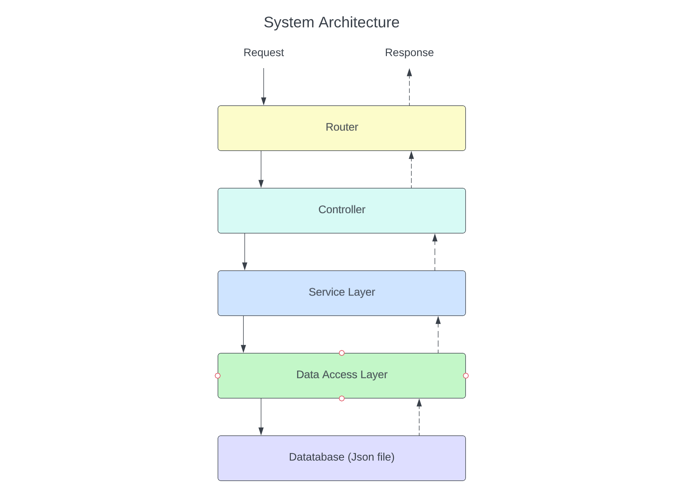
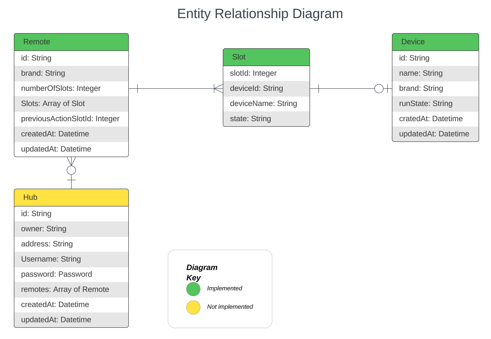
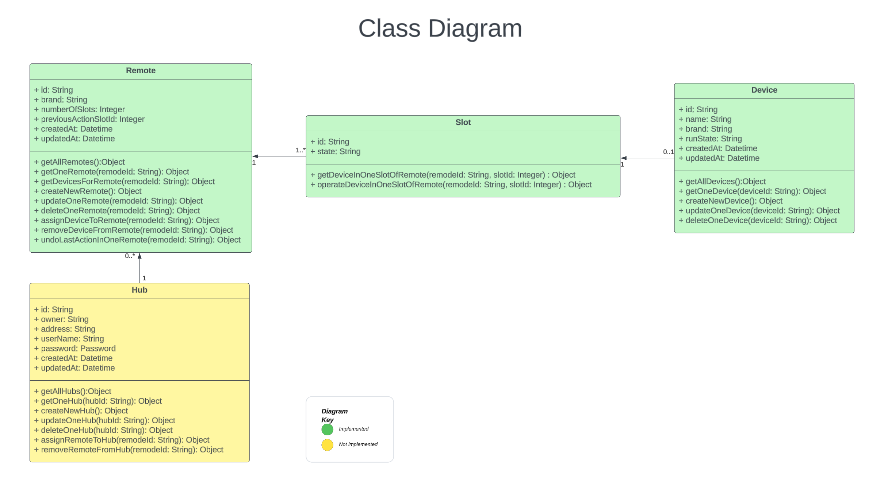

# aXmos-HomeHub-Api
aXmos-HomeHub-Api is a proof-of-concept API collection of a Cloud Based Home Automation system built on Node.js. 

## System Design


Router from Express.js will pass HTTP requests to corresponding controller.

Controller will handle HTTP requests and responses for endpoints.

Service Layer contains the business logic that are exposed to Controller as services.

Data Access Layer will handle Database opearations. It will export some methods for database operations to be used by Service Layer.

Database will be a local JSON file.





## Setup
### Prerequisites
[Node.js] (https://nodejs.org/en/docs)

### Steps
1. Create a folder
```sh
mkdir repo
```
2. Navigate to folder
```sh
cd ./repo
```
3. Clone the repo
```sh
git clone https://github.com/sanjdi/aXmos-HomeHub-Api.git
```
4. Navigate to project root folder
```sh
cd ./aXmos-HomeHub-Api
```
5. Download all dependencies
```sh
npm install
```
6. Start the server
```sh
npm start
```
7. If all went ok, you will see bellow lines at the end of the terminal window.
```sh
aXmos HomeHub Api is listening on port 5004
Version 1 Docs are available on http://localhost:5004/api/v1/docs
```

## API Doc
Once the server is up after #7 above, a fully functional swagger doc is vailable at bellow uri. It allows you to test endpoints.
```sh
http://{server}:{port}/api/v1/docs
```

### Key endpoints
To turn a device on/off using a remote;
```sh
/api/v1/remotes/{remoteId}/devices/{slotId}
```
To undo last operation of a remote;
```sh
/api/v1/remotes/{remoteId}/undo
```

## References
[Node.js] (https://nodejs.org/en/docs)
[Express.js] (https://expressjs.com/en/guide/routing.html)
[Swagger] (https://swagger.io/docs/specification/about/)
[OpenAPI Specification] (https://github.com/OAI/OpenAPI-Specification/blob/main/versions/3.0.3.md)
[REST API Design Best Practices Handbook] (https://www.freecodecamp.org/news/rest-api-design-best-practices-build-a-rest-api/)


